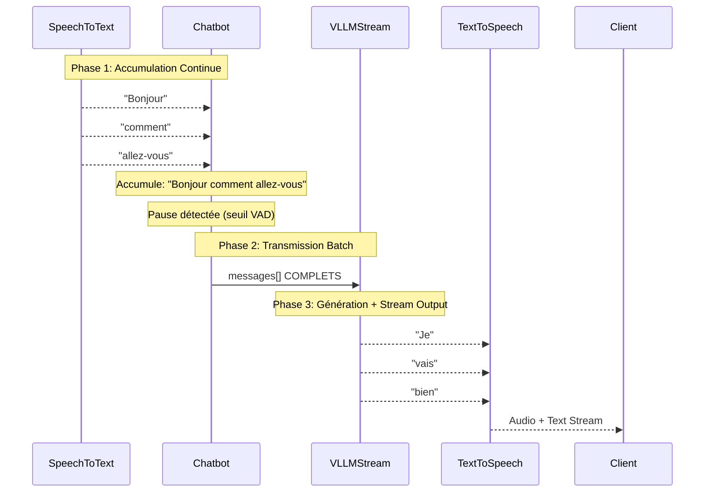

# Analyse du Streaming ASR ↔ LLM dans le Backend Unmute

## Résumé Exécutif

Après analyse approfondie du code, le backend Unmute réalise un **streaming hybride** :
- **ASR → LLM** : Accumulation batch (pas de streaming en entrée)
- **LLM → Client** : Streaming réel token par token
- **Interruptions** : Gestion temps réel via VAD et détection de mots

## Point Clé : PAS de Streaming en Entrée du LLM

**Le LLM ne reçoit PAS un stream en entrée**. Le processus fonctionne par accumulation puis transmission complète.

## Architecture du Flux de Données

### Pipeline Asynchrone Global

```mermaid
graph TD
    A[WebSocket Client] --> B[receive_loop()]
    B --> C[UnmuteHandler.receive()]
    C --> D[STT.send_audio()]
    D --> E[STT async iterator]
    E --> F[Chatbot.add_chat_message_delta()]
    F --> G[Pause Detection]
    G --> H[_generate_response()]
    H --> I[LLM Streaming]
    I --> J[rechunk_to_words()]
    J --> K[TTS + emit_queue]
    K --> L[emit_loop()]
    L --> A
```

### Séquence Détaillée par Phase



## Phases Détaillées

### 1. Phase d'Accumulation ASR → Chatbot

**Fichier:** [`unmute_handler.py:461`](../unmute/unmute_handler.py#L461)
```python
# Chaque mot STT est ACCUMULÉ dans le chatbot
is_new_message = await self.add_chat_message_delta(data.text, "user")
```

**Fichier:** [`chatbot.py:74`](../unmute/llm/chatbot.py#L74)
```python
# Les mots sont concaténés
self.chat_history[-1]["content"] += delta
```

**Comportement:**
- L'ASR envoie des mots individuels en streaming
- Le [`Chatbot`](../unmute/llm/chatbot.py#L12) **accumule** ces mots dans `chat_history`
- Aucun envoi au LLM pendant cette phase
- Streaming uniquement pour le client (affichage temps réel)

### 2. Détection de Pause → Transmission Complète

**Fichier:** [`unmute_handler.py:340-370`](../unmute/unmute_handler.py#L340-L370)
```python
if self.determine_pause():  # Pause détectée
    await self._generate_response()  # Déclenche le LLM
```

**Fichier:** [`unmute_handler.py:209`](../unmute/unmute_handler.py#L209)
```python
# TOUTE la transcription accumulée est envoyée
messages = self.chatbot.preprocessed_messages()
```

**Détection de Pause:** [`unmute_handler.py:387`](../unmute/unmute_handler.py#L387)
```python
if stt.pause_prediction.value > 0.6:  # Seuil VAD
    return True  # Déclenche le LLM
```

**Comportement:**
- La pause est détectée via `determine_pause()` (seuil VAD > 0.6)
- **Tout l'historique de chat** est envoyé au LLM d'un coup
- Le LLM reçoit le contexte complet, pas un stream

### 3. LLM Stream Output Uniquement

**Fichier:** [`llm_utils.py:152-157`](../unmute/llm/llm_utils.py#L152-L157)
```python
stream = await self.client.chat.completions.create(
    model=self.model,
    messages=messages,  # COMPLET !
    stream=True  # Stream SORTIE uniquement
)
```

**Fichier:** [`unmute_handler.py:225`](../unmute/unmute_handler.py#L225)
```python
# Le LLM stream SEULEMENT sa réponse
async for delta in rechunk_to_words(llm.chat_completion(messages)):
```

**Rechunking:** [`llm_utils.py:63-89`](../unmute/llm/llm_utils.py#L63-L89)
```python
async def rechunk_to_words(iterator: AsyncIterator[str]) -> AsyncIterator[str]:
    """Rechunk the stream of text to whole words.
    
    Otherwise the TTS doesn't know where word boundaries are and will mispronounce
    split words.
    """
```

**Comportement:**
- Le LLM reçoit tous les messages en une fois
- Il stream **uniquement sa réponse** token par token
- `rechunk_to_words()` découpe les tokens en mots pour le TTS
- Chaque mot est immédiatement envoyé au TTS et au client

## Points Techniques Cruciaux

### Gestion des Interruptions Temps Réel

**Interruption par VAD:** [`unmute_handler.py:352-359`](../unmute/unmute_handler.py#L352-L359)
```python
if (self.chatbot.conversation_state() == "bot_speaking" 
    and stt.pause_prediction.value < 0.4):
    await self.interrupt_bot()  # Coupe le LLM/TTS
```

**Interruption par Mots STT:** [`unmute_handler.py:456-458`](../unmute/unmute_handler.py#L456-L458)
```python
if self.chatbot.conversation_state() == "bot_speaking":
    await self.interrupt_bot()  # Dès qu'un mot arrive
```

**Mécanisme d'Interruption:** [`unmute_handler.py:583-607`](../unmute/unmute_handler.py#L583-L607)
```python
async def interrupt_bot(self):
    # Ajoute le caractère d'interruption
    await self.add_chat_message_delta(INTERRUPTION_CHAR, "assistant")
    
    # Vide les queues
    self.output_queue = asyncio.Queue()
    
    # Arrête les services
    await self.quest_manager.remove("tts")
    await self.quest_manager.remove("llm")
```

### Coordination Asynchrone

**Architecture Pipeline:** [`unmute_handler.py:375-382`](../unmute/unmute_handler.py#L375-L382)
```python
async with asyncio.TaskGroup() as tg:
    tg.create_task(receive_loop(...))  # ASR input
    tg.create_task(emit_loop(...))     # LLM output
    tg.create_task(handler.quest_manager.wait())  # Service lifecycle
```

**Queues de Coordination:** [`unmute_handler.py:89`](../unmute/unmute_handler.py#L89)
```python
self.output_queue: asyncio.Queue[HandlerOutput] = asyncio.Queue()
```

### Quest Manager pour Services

**Gestion STT:** [`unmute_handler.py:422-434`](../unmute/unmute_handler.py#L422-L434)
```python
async def start_up_stt(self):
    quest = await self.quest_manager.add(Quest("stt", _init, _run, _close))
    await quest.get()  # Attend que STT soit prêt
```

**Gestion TTS:** [`unmute_handler.py:470-506`](../unmute/unmute_handler.py#L470-L506)
```python
async def start_up_tts(self, generating_message_i: int) -> Quest[TextToSpeech]:
    return await self.quest_manager.add(Quest("tts", _init, _run, _close))
```

## Composants Clés

### SpeechToText (ASR)

**Fichier:** [`speech_to_text.py`](../unmute/stt/speech_to_text.py)

**Connexion WebSocket:** [`speech_to_text.py:130-135`](../unmute/stt/speech_to_text.py#L130-L135)
```python
self.websocket = await websockets.connect(
    self.stt_instance + SPEECH_TO_TEXT_PATH, 
    additional_headers=HEADERS
)
```

**Stream de Mots:** [`speech_to_text.py:175-197`](../unmute/stt/speech_to_text.py#L175-L197)
```python
async def __aiter__(self) -> AsyncIterator[STTWordMessage | STTMarkerMessage]:
    async for message_bytes in self.websocket:
        match message:
            case STTWordMessage():
                yield message  # Stream de mots en temps réel
```

**Pause Prediction:** [`speech_to_text.py:87-89`](../unmute/stt/speech_to_text.py#L87-L89)
```python
self.pause_prediction = ExponentialMovingAverage(
    attack_time=0.01, release_time=0.01, initial_value=1.0
)
```

### Chatbot (Accumulation)

**Fichier:** [`chatbot.py`](../unmute/llm/chatbot.py)

**États de Conversation:** [`chatbot.py:21-37`](../unmute/llm/chatbot.py#L21-L37)
```python
def conversation_state(self) -> ConversationState:
    # "waiting_for_user", "user_speaking", "bot_speaking"
```

**Ajout Incrémental:** [`chatbot.py:39-75`](../unmute/llm/chatbot.py#L39-L75)
```python
async def add_chat_message_delta(self, delta: str, role: str):
    # Ajoute le mot au message en cours avec gestion des espaces
    if needs_space_left and needs_space_right:
        delta = " " + delta
    self.chat_history[-1]["content"] += delta
```

### VLLMStream (LLM)

**Fichier:** [`llm_utils.py`](../unmute/llm/llm_utils.py)

**Client OpenAI:** [`llm_utils.py:120-121`](../unmute/llm/llm_utils.py#L120-L121)
```python
def get_openai_client(server_url: str = LLM_SERVER) -> AsyncOpenAI:
    return AsyncOpenAI(api_key="EMPTY", base_url=server_url + "/v1")
```

**Chat Completion:** [`llm_utils.py:149-170`](../unmute/llm/llm_utils.py#L149-L170)
```python
async def chat_completion(self, messages: list[dict[str, str]]) -> AsyncIterator[str]:
    stream = await self.client.chat.completions.create(
        model=self.model,
        messages=messages,  # Messages COMPLETS
        stream=True,
        temperature=self.temperature,
    )
    
    async with stream:
        async for chunk in stream:
            if chunk_content := chunk.choices[0].delta.content:
                yield chunk_content  # Stream output token par token
```

## Pipeline WebSocket

### Réception Audio

**Fichier:** [`main_websocket.py:443-460`](../unmute/main_websocket.py#L443-L460)
```python
# Décodage Opus -> PCM
opus_bytes = base64.b64decode(message.audio)
pcm = await asyncio.to_thread(opus_reader.append_bytes, opus_bytes)
if pcm.size:
    await handler.receive((SAMPLE_RATE, pcm[np.newaxis, :]))
```

### Émission Réponses

**Fichier:** [`main_websocket.py:495-564`](../unmute/main_websocket.py#L495-L564)
```python
async def emit_loop(websocket, handler, emit_queue):
    while True:
        emitted_by_handler = await handler.emit()
        if isinstance(emitted_by_handler, ora.ServerEvent):
            to_emit = emitted_by_handler
        else:
            # Audio PCM -> Opus
            opus_bytes = await asyncio.to_thread(opus_writer.append_pcm, audio)
            to_emit = ora.ResponseAudioDelta(
                delta=base64.b64encode(opus_bytes).decode("utf-8")
            )
        
        await websocket.send_text(to_emit.model_dump_json())
```

## Configuration et Constantes

### Paramètres Temporels

**Fichier:** [`unmute_handler.py:57-65`](../unmute/unmute_handler.py#L57-L65)
```python
USER_SILENCE_TIMEOUT = 7.0  # Timeout silence utilisateur
FIRST_MESSAGE_TEMPERATURE = 0.7  # Température premier message
FURTHER_MESSAGES_TEMPERATURE = 0.3  # Température messages suivants
UNINTERRUPTIBLE_BY_VAD_TIME_SEC = 3  # Protection echo cancellation
```

### Serveurs et URLs

**Fichier:** [`kyutai_constants.py`](../unmute/kyutai_constants.py)
```python
STT_SERVER = "ws://stt-server:port"
LLM_SERVER = "http://llm-server:port" 
TTS_SERVER = "ws://tts-server:port"
```

## Conclusion

### Architecture Finale

Le backend Unmute réalise un **streaming hybride intelligent** :

1. **ASR → LLM : Batch Processing**
   - Accumulation continue des mots ASR dans le chatbot
   - Transmission complète sur détection de pause (seuil VAD > 0.6)
   - Pas de streaming en entrée LLM (contrairement aux apparences)

2. **LLM → Client : True Streaming**
   - Génération token par token via OpenAI Streaming API
   - Rechunking intelligent en mots pour le TTS
   - Stream immédiat vers client via WebSocket

3. **Gestion des Interruptions : Temps Réel**
   - VAD et mots ASR peuvent couper le LLM instantanément
   - Queues vidées, nouvelles sessions créées
   - Réactivité maximale à l'utilisateur

### Avantages de cette Architecture

- **Latence optimisée** : Pas d'attente de fin de phrase complète
- **Qualité TTS** : Mots complets évitent les artefacts de prononciation
- **Interruptions fluides** : Réaction temps réel aux interventions utilisateur
- **Robustesse** : Gestion d'erreurs et reconnexions automatiques
- **Scalabilité** : Architecture asynchrone avec limitation de clients

Cette architecture permet une expérience conversationnelle naturelle avec une latence minimale tout en maintenant la qualité audio et la robustesse du système.